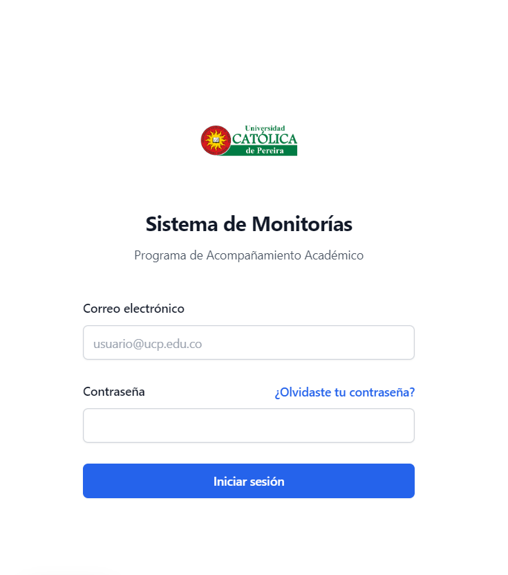
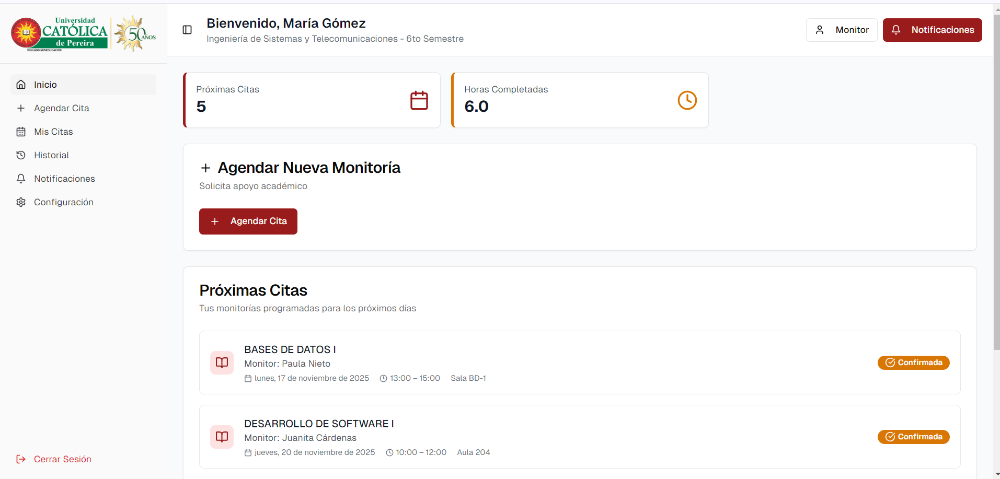
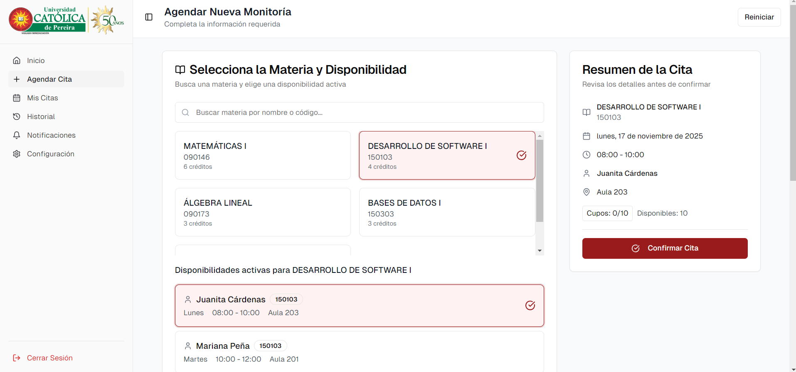
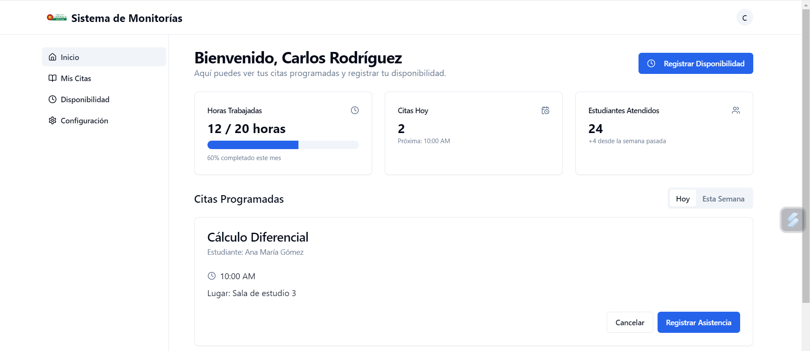
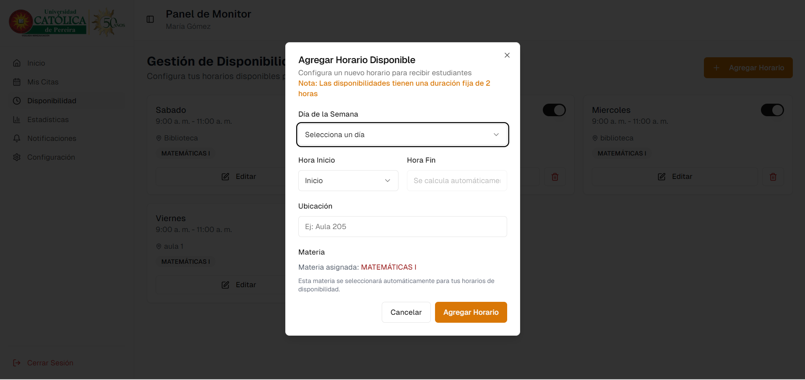
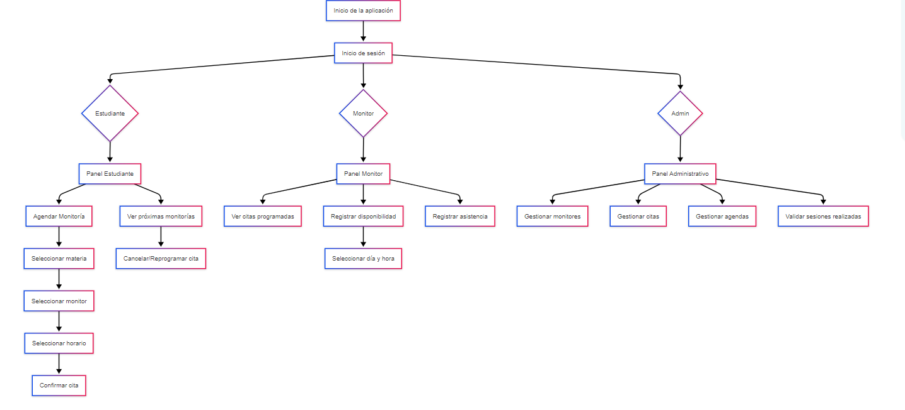
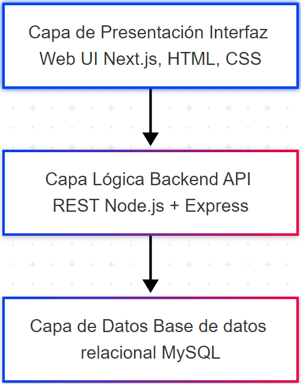

# Plataforma Web para la Gestión de Monitorías Académicas del PAC – Universidad Católica de Pereira

Este proyecto consiste en el desarrollo de una aplicación web destinada a optimizar el proceso de gestión de monitorías académicas, mejorando la trazabilidad, organización y eficiencia de las sesiones entre estudiantes y monitores dentro del Programa de Acompañamiento al Currículo (PAC).

---

### Características Principales

Esta plataforma integral incluye funcionalidades clave segmentadas según los perfiles de usuario:

* **Estudiantes:**
    * Visualización de disponibilidad de monitores.
    * Agendar monitorías paso a paso (materia, monitor, horario, confirmación).
    *	Visualizar sus sesiones agendadas.
    *	Cancelar o reprogramar citas.
    *	Recibir recordatorios de monitorías programadas.


* **Monitores:**
    * Registrar disponibilidad horaria.
    * Visualización de citas programadas.
    * Registro de asistencia.
    * Consulta de horas trabajadas acumuladas.

* **Administrador / Coordinador PAC:**
    * Creación, edición y eliminación de perfiles de monitores.
    * Gestión completa de agendas y citas del sistema.
    * Validación de sesiones realizadas.

---

### Vistas de la Interfaz de Usuario (Mockups Visuales)
A continuación, se presentan capturas de pantalla de las interfaces clave de la aplicación, mostrando el diseño y la interacción propuesta:

#### Vista de Inicio de Sesion

Permite a un usuario acceder a su panel personalizado y funcionalidades de la aplicación.

#### Vista de Pantalla Principal de Estudiante

Muestra la pantalla principal a la que accede el estudiante una vez inicia sesión. Desde aquí puede consultar sus próximas citas y acceder rápidamente al agendamiento de nuevas monitorías.

#### Vista de Agendamiento de Monitoria

Pantallas del proceso para agendar una monitoría. El estudiante elige materia, monitor, horario y confirma la cita.

#### Vista de Pantalla Principal de Monitor

Vista principal del monitor, donde puede ver sus citas programadas, consultar estadísticas de horas trabajadas y registrar asistencia de sesiones pasadas.

#### Vista de Registro de Disponibilidad

Interfaz donde el monitor puede seleccionar los días y horas en que está disponible para atender estudiantes.


---

#### Diagrama General(Flujo del Software)
Este diagrama representa el recorrido lógico que realiza un usuario dentro del sistema, desde su autenticación hasta la finalización de una sesión de monitoría.



#### Diagrama de Arquitectura por Capas
Representa la estructura en capas del software, mostrando la separación entre la interfaz de usuario, la lógica del sistema y la gestión de datos. Favorece la mantenibilidad y escalabilidad del sistema.



---

## Estructura de la Base de Datos
El esquema completo de la base de datos se encuentra en `docs/database/schema.sql`. Incluye entidades como usuarios, sesiones, disponibilidad, validaciones y reportes.

#### Modelo Entidad-Relación (MER)
Describe las principales entidades del sistema y sus relaciones. Es útil para comprender la lógica del modelo de datos a un nivel conceptual.


#### Modelo Relacional
Detalle físico de la estructura de la base de datos: incluye tablas, columnas, claves primarias y foráneas, tipos de datos y relaciones entre ellas.


---

## Configuración del Entorno de Desarrollo

### Estructura del Repositorio

* /app/: Contiene todo el código de la aplicación web.
* `/Docs/`: Documentación del proyecto, incluyendo:
    * `/Docs/Architecture/`: Diagramas de arquitectura y flujo (ej. `diagrama-general-aplicacion.png`, `diagramacapas.png`).
    * `/Docs/Database/`: Esquema de la base de datos (`schema.sql`, `mer.png`, `modelo-relacional.png`).
* `.gitignore`: Para excluir archivos no deseados (como `node_modules/` o `.env`).
* `README.md`: Este archivo de descripción del proyecto.

### Pasos para Ejecución Local

```bash
# Clonar el repositorio
[https://github.com/usuario/plataforma-monitorias-pac.git](https://github.com/Sebastian200512/gestion-monitorias-academicas.git)

# Backend
cd backend
npm install
npm start

# Frontend
cd ../frontend
npm install
npm run dev
```

### Configurar Base de Datos

- Crear una base de datos `monitorias_pac` en MySQL.
- Importar el archivo `schema.sql` ubicado en `/database/`.

### Archivo `.env`

```
DB_HOST=localhost
DB_USER=tu_usuario
DB_PASSWORD=tu_contraseña
DB_NAME=monitorias_pac
```

---

## Tecnologías Utilizadas

- **Frontend:** Next.js
- **Backend:** Node.js + Express
- **Base de datos:** MySQL
- **Control de versiones:** GitHub

---

## Contribuciones

Este es un proyecto académico desarrollado por:

- **DAVID RICARDO RIVERA ARBELAEZ**
- **Sebastián Patiño Pineda**
- **Cristhian Andres Avalo Valencia**

---

## Licencia

Todos los derechos reservados. Este proyecto es para fines académicos y no se permite su uso o distribución comercial sin autorización expresa.

