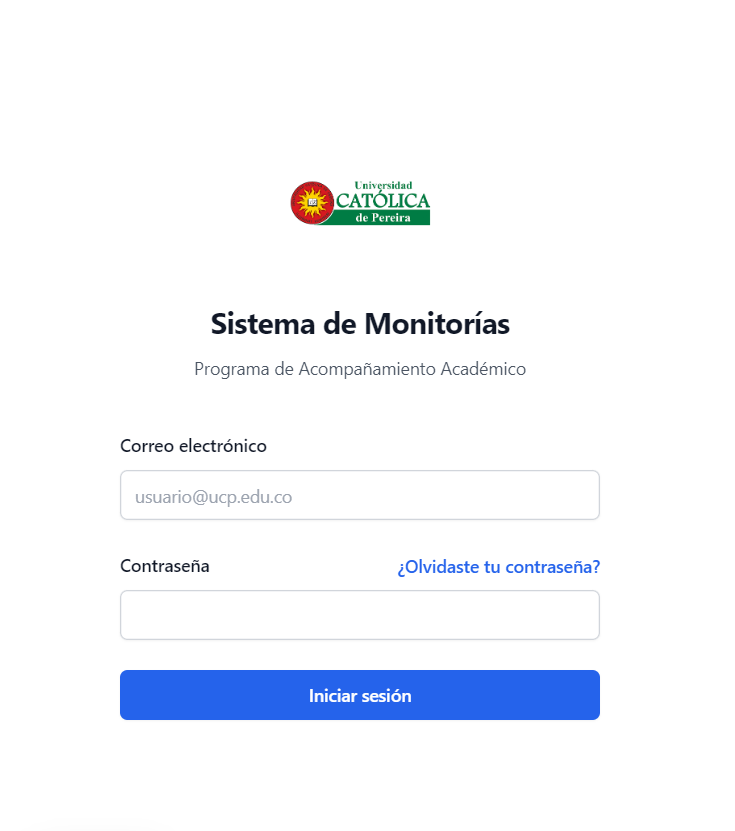
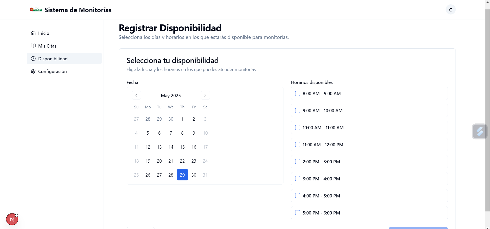

# Gestión de Monitorías Académicas - UCP

Sistema web para la gestión de monitorías académicas en la Universidad Católica de Pereira. Permite a estudiantes agendar sesiones con monitores, gestionar disponibilidades y administrar el sistema de manera eficiente.

## Características Principales

- **Dashboard para Estudiantes**: Agendamiento de monitorías, visualización de citas y seguimiento de sesiones.
- **Dashboard para Monitores**: Gestión de disponibilidades, confirmación de citas y registro de asistencias.
- **Panel de Administración**: Gestión de usuarios, materias, reportes y configuración del sistema.
- **Sistema de Autenticación**: Login seguro con roles diferenciados (Estudiante, Monitor, Administrador).
- **Gestión de Disponibilidades**: Monitores pueden registrar horarios disponibles para sesiones.
- **Registro de Asistencias**: Validación de sesiones realizadas con aprobación administrativa.

## Arquitectura del Sistema

### Diagrama General de la Aplicación


### Diagrama de Capas


El sistema sigue una arquitectura de capas que separa la presentación, lógica de negocio y persistencia de datos.

## Base de Datos

### Modelo Relacional


### Esquema de Base de Datos

```sql
-- Crear base de datos
CREATE DATABASE IF NOT EXISTS monitorias;
USE monitorias;

-- Tabla de administradores del sistema
CREATE TABLE admins (
  id INT NOT NULL AUTO_INCREMENT,
  codigo VARCHAR(20) NOT NULL,
  nombre_completo VARCHAR(100) NOT NULL,
  correo VARCHAR(100) NOT NULL,
  contrasena VARCHAR(255) NOT NULL,
  cargo VARCHAR(80) DEFAULT NULL,
  telefono VARCHAR(25) DEFAULT NULL,
  activo TINYINT(1) NOT NULL DEFAULT 1,
  created_at DATETIME NOT NULL DEFAULT CURRENT_TIMESTAMP,
  updated_at DATETIME NOT NULL DEFAULT CURRENT_TIMESTAMP ON UPDATE CURRENT_TIMESTAMP,
  PRIMARY KEY (id),
  UNIQUE KEY uk_admin_codigo (codigo),
  UNIQUE KEY uk_admin_correo (correo)
);

-- Tabla de usuarios (estudiantes y monitores)
CREATE TABLE usuarios (
  id INT NOT NULL AUTO_INCREMENT,
  codigo VARCHAR(20) NOT NULL,
  nombre_completo VARCHAR(100) NOT NULL,
  correo VARCHAR(100) NOT NULL,
  contrasena VARCHAR(255) NOT NULL,
  programa VARCHAR(100) DEFAULT NULL,
  semestre TINYINT UNSIGNED DEFAULT NULL,
  activo TINYINT(1) NOT NULL DEFAULT 1,
  created_at DATETIME NOT NULL DEFAULT CURRENT_TIMESTAMP,
  updated_at DATETIME NOT NULL DEFAULT CURRENT_TIMESTAMP ON UPDATE CURRENT_TIMESTAMP,
  PRIMARY KEY (id),
  UNIQUE KEY uk_usuario_codigo (codigo),
  UNIQUE KEY uk_usuario_correo (correo)
);

-- Tabla de roles (ESTUDIANTE, MONITOR, etc.)
CREATE TABLE roles (
  id INT NOT NULL AUTO_INCREMENT,
  nombre VARCHAR(50) NOT NULL,
  PRIMARY KEY (id),
  UNIQUE KEY uk_rol_nombre (nombre)
);

-- Tabla intermedia para asignar uno o varios roles a cada usuario
CREATE TABLE usuario_rol (
  usuario_id INT NOT NULL,
  rol_id INT NOT NULL,
  asignado_por_admin INT DEFAULT NULL,
  asignado_en DATETIME NOT NULL DEFAULT CURRENT_TIMESTAMP,
  PRIMARY KEY (usuario_id, rol_id),
  KEY idx_ur_rol (rol_id),
  KEY idx_ur_admin (asignado_por_admin),
  CONSTRAINT fk_ur_usuario FOREIGN KEY (usuario_id) REFERENCES usuarios (id),
  CONSTRAINT fk_ur_rol FOREIGN KEY (rol_id) REFERENCES roles (id),
  CONSTRAINT fk_ur_admin FOREIGN KEY (asignado_por_admin) REFERENCES admins (id)
);

-- Tabla de materias
CREATE TABLE materias (
  id INT NOT NULL AUTO_INCREMENT,
  nombre VARCHAR(100) NOT NULL,
  codigo VARCHAR(20) NOT NULL,
  creditos TINYINT UNSIGNED DEFAULT NULL,
  estado ENUM('Activo', 'Inactivo') NOT NULL DEFAULT 'Activo',
  PRIMARY KEY (id),
  UNIQUE KEY uk_materia_codigo (codigo)
);

-- Tabla de disponibilidades de monitores (por materia y día)
CREATE TABLE disponibilidades (
  id INT NOT NULL AUTO_INCREMENT,
  monitor_id INT NOT NULL,
  materia_id INT NOT NULL,
  dia ENUM('Lunes','Martes','Miercoles','Jueves','Viernes') NOT NULL,
  hora_inicio TIME NOT NULL,
  hora_fin TIME NOT NULL,
  ubicacion VARCHAR(100) DEFAULT NULL,
  estado ENUM('Activa','Inactiva','Cerrada') NOT NULL DEFAULT 'Activa',
  created_at DATETIME NOT NULL DEFAULT CURRENT_TIMESTAMP,
  PRIMARY KEY (id),
  KEY idx_disp_monitor (monitor_id),
  KEY idx_disp_materia (materia_id),
  CONSTRAINT fk_disp_monitor FOREIGN KEY (monitor_id) REFERENCES usuarios (id),
  CONSTRAINT fk_disp_materia FOREIGN KEY (materia_id) REFERENCES materias (id),
  CONSTRAINT chk_disp_horas CHECK (hora_inicio < hora_fin)
);

-- Tabla de citas de monitoría
CREATE TABLE citas (
  id INT NOT NULL AUTO_INCREMENT,
  estudiante_id INT NOT NULL,
  monitor_id INT NOT NULL,
  disponibilidad_id INT DEFAULT NULL,
  materia_id INT NOT NULL,
  fecha_cita DATE NOT NULL,
  hora_inicio TIME NOT NULL,
  hora_fin TIME NOT NULL,
  ubicacion VARCHAR(100) DEFAULT NULL,
  estado ENUM('pendiente','confirmada','completada','cancelada') NOT NULL DEFAULT 'pendiente',
  created_at DATETIME NOT NULL DEFAULT CURRENT_TIMESTAMP,
  PRIMARY KEY (id),
  KEY idx_citas_monitor_fecha (monitor_id, fecha_cita, estado),
  KEY idx_citas_estudiante_fecha (estudiante_id, fecha_cita),
  CONSTRAINT fk_cita_estudiante FOREIGN KEY (estudiante_id) REFERENCES usuarios (id),
  CONSTRAINT fk_cita_monitor FOREIGN KEY (monitor_id) REFERENCES usuarios (id),
  CONSTRAINT fk_cita_disponibilidad FOREIGN KEY (disponibilidad_id) REFERENCES disponibilidades (id),
  CONSTRAINT fk_cita_materia FOREIGN KEY (materia_id) REFERENCES materias (id),
  CONSTRAINT chk_cita_horas CHECK (hora_inicio < hora_fin)
);

-- Tabla de asistencias (una por cita)
CREATE TABLE asistencias (
  id INT NOT NULL AUTO_INCREMENT,
  cita_id INT NOT NULL,
  fecha_registro DATETIME NOT NULL DEFAULT CURRENT_TIMESTAMP,
  validada_por_admin TINYINT(1) NOT NULL DEFAULT 0,
  admin_id INT DEFAULT NULL,
  PRIMARY KEY (id),
  UNIQUE KEY uk_asistencia_cita (cita_id),
  KEY idx_asistencia_admin (admin_id),
  CONSTRAINT fk_asistencia_cita FOREIGN KEY (cita_id) REFERENCES citas (id) ON DELETE CASCADE,
  CONSTRAINT fk_asistencia_admin FOREIGN KEY (admin_id) REFERENCES admins (id)
);
```
Nota: La asignación de roles se maneja con la tabla intermedia usuario_rol, lo que permite que un mismo usuario pueda ser estudiante y monitor al mismo tiempo.

## Capturas de Pantalla

### Inicio de Sesión


### Pantalla Principal del Estudiante


### Pantalla Principal del Monitor


### Agendamiento de Monitoría


### Registro de Disponibilidad


## Tecnologías Utilizadas

- **Frontend**: Next.js, React, TypeScript, Tailwind CSS
- **UI Components**: Shadcn/ui
- **Backend**: API REST integrada en Next.js (Node.js + Route Handlers)
- **Base de Datos**: MySQL
- **Autenticación**: JWT (preparado)
- **Control de Versiones**: Git, GitHub

## Instalación

1. Clona el repositorio:
   ```bash
   git clone https://github.com/Sebastian200512/gestion-monitorias-academicas.git
   cd gestion-monitorias-academicas
   ```

2. Instala las dependencias:
   ```bash
   npm install
   # o
   pnpm install
   ```

3. Configura las variables de entorno:
   Crea un archivo `.env.local` con:
   ```
   NEXT_PUBLIC_API_URL=http://localhost:3001/api
   NEXT_PUBLIC_API_TOKEN=tu_token_aqui
   ```

4. Ejecuta la aplicación:
   ```bash
   npm run dev
   # o
   pnpm dev
   ```

5. Accede a http://localhost:3000

## Uso

### Para Estudiantes
1. Inicia sesión con tu cuenta de estudiante.
2. Explora las materias disponibles y monitores.
3. Agenda una cita seleccionando fecha, hora y materia.
4. Visualiza tus citas pendientes y realizadas.

### Para Monitores
1. Inicia sesión con tu cuenta de monitor.
2. Registra tus disponibilidades horarias.
3. Confirma o rechaza citas solicitadas.
4. Registra asistencias después de las sesiones.

### Para Administradores
1. Inicia sesión con cuenta administrativa.
2. Gestiona usuarios, materias y citas.
3. Revisa reportes y estadísticas.
4. Valida asistencias registradas.

## Contribución

1. Fork el proyecto
2. Crea una rama para tu feature (`git checkout -b feature/nueva-funcionalidad`)
3. Commit tus cambios (`git commit -am 'Agrega nueva funcionalidad'`)
4. Push a la rama (`git push origin feature/nueva-funcionalidad`)
5. Abre un Pull Request

## Licencia

Este proyecto es parte del trabajo final para la Universidad Católica de Pereira.

## Contacto

Sebastian Patiño - sebastian2.patino@ucp.edu.co
Cristhian Avalo - cristhian1.avalo@ucp.edu.co

Proyecto Final - Gestión de Monitorías Académicas
