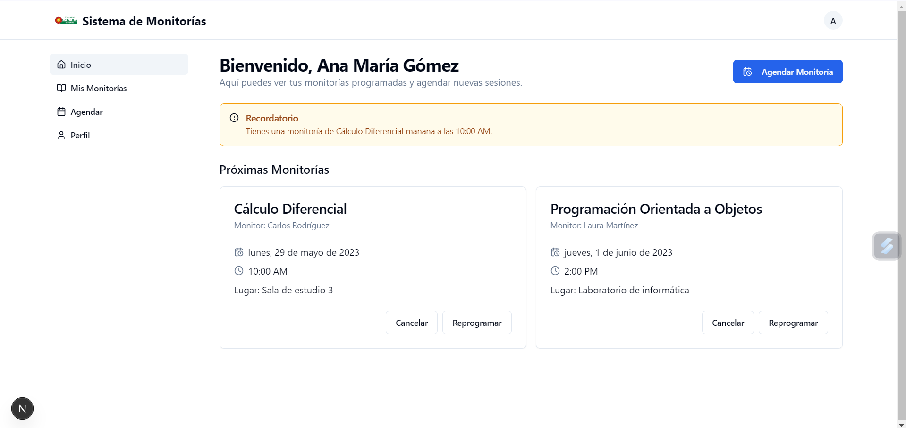
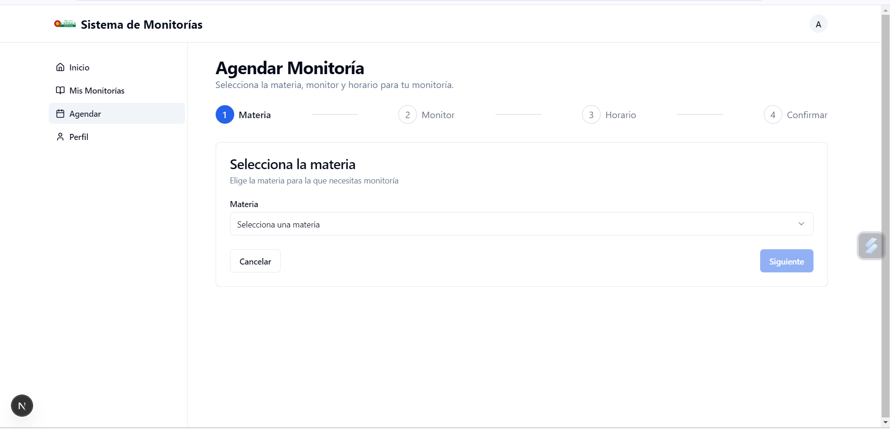

# Gestión de Monitorías Académicas - UCP

Sistema web para la gestión de monitorías académicas en la Universidad Católica de Pereira. Permite a estudiantes agendar sesiones con monitores, gestionar disponibilidades y administrar el sistema de manera eficiente.

## Características Principales

- **Dashboard para Estudiantes**: Agendamiento de monitorías, visualización de citas y seguimiento de sesiones.
- **Dashboard para Monitores**: Gestión de disponibilidades, confirmación de citas y registro de asistencias.
- **Panel de Administración**: Gestión de usuarios, materias, reportes y configuración del sistema.
- **Sistema de Autenticación**: Login seguro con roles diferenciados (Estudiante, Monitor, Administrador).
- **Gestión de Disponibilidades**: Monitores pueden registrar horarios disponibles para sesiones.
- **Registro de Asistencias**: Validación de sesiones realizadas con aprobación administrativa.

## Arquitectura del Sistema

### Diagrama General de la Aplicación


### Diagrama de Capas


El sistema sigue una arquitectura de capas que separa la presentación, lógica de negocio y persistencia de datos.

## Base de Datos

### Modelo Relacional


### Esquema de Base de Datos

```sql
-- Crear base de datos
CREATE DATABASE IF NOT EXISTS monitorias_pac;
USE monitorias_pac;

-- Tabla de roles
CREATE TABLE roles (
    id INT AUTO_INCREMENT PRIMARY KEY,
    nombre VARCHAR(50) NOT NULL
);

-- Tabla de usuarios
CREATE TABLE usuarios (
    id INT AUTO_INCREMENT PRIMARY KEY,
    nombre_completo VARCHAR(100) NOT NULL,
    correo VARCHAR(100) UNIQUE NOT NULL,
    contrasena VARCHAR(255) NOT NULL,
    rol_id INT,
    FOREIGN KEY (rol_id) REFERENCES roles(id)
);

-- Tabla de materias
CREATE TABLE materias (
    id INT AUTO_INCREMENT PRIMARY KEY,
    nombre VARCHAR(100) NOT NULL,
    codigo VARCHAR(20) UNIQUE NOT NULL
);

-- Tabla de disponibilidades de monitores
CREATE TABLE disponibilidades (
    id INT AUTO_INCREMENT PRIMARY KEY,
    monitor_id INT,
    fecha DATE NOT NULL,
    hora_inicio TIME NOT NULL,
    hora_fin TIME NOT NULL,
    estado ENUM('disponible', 'ocupado') DEFAULT 'disponible',
    FOREIGN KEY (monitor_id) REFERENCES usuarios(id)
);

-- Tabla de citas agendadas
CREATE TABLE citas (
    id INT AUTO_INCREMENT PRIMARY KEY,
    estudiante_id INT,
    disponibilidad_id INT,
    materia_id INT,
    fecha_cita DATE NOT NULL,
    hora_cita TIME NOT NULL,
    estado ENUM('pendiente', 'realizada', 'cancelada') DEFAULT 'pendiente',
    FOREIGN KEY (estudiante_id) REFERENCES usuarios(id),
    FOREIGN KEY (disponibilidad_id) REFERENCES disponibilidades(id),
    FOREIGN KEY (materia_id) REFERENCES materias(id)
);

-- Tabla de asistencias
CREATE TABLE asistencias (
    id INT AUTO_INCREMENT PRIMARY KEY,
    cita_id INT,
    monitor_id INT,
    estudiante_id INT,
    fecha_registro DATETIME DEFAULT CURRENT_TIMESTAMP,
    validada_por_admin BOOLEAN DEFAULT FALSE,
    FOREIGN KEY (cita_id) REFERENCES citas(id),
    FOREIGN KEY (monitor_id) REFERENCES usuarios(id),
    FOREIGN KEY (estudiante_id) REFERENCES usuarios(id)
);
```

## Capturas de Pantalla

### Inicio de Sesión


### Pantalla Principal del Estudiante


### Pantalla Principal del Monitor


### Agendamiento de Monitoría


### Registro de Disponibilidad


## Tecnologías Utilizadas

- **Frontend**: Next.js, React, TypeScript, Tailwind CSS
- **UI Components**: Shadcn/ui
- **Backend**: Node.js (preparado para integración)
- **Base de Datos**: MySQL
- **Autenticación**: JWT (preparado)
- **Control de Versiones**: Git, GitHub

## Instalación

1. Clona el repositorio:
   ```bash
   git clone https://github.com/Sebastian200512/gestion-monitorias-academicas.git
   cd gestion-monitorias-academicas
   ```

2. Instala las dependencias:
   ```bash
   npm install
   # o
   pnpm install
   ```

3. Configura las variables de entorno:
   Crea un archivo `.env.local` con:
   ```
   NEXT_PUBLIC_API_URL=http://localhost:3001/api
   NEXT_PUBLIC_API_TOKEN=tu_token_aqui
   ```

4. Ejecuta la aplicación:
   ```bash
   npm run dev
   # o
   pnpm dev
   ```

5. Accede a http://localhost:3000

## Uso

### Para Estudiantes
1. Inicia sesión con tu cuenta de estudiante.
2. Explora las materias disponibles y monitores.
3. Agenda una cita seleccionando fecha, hora y materia.
4. Visualiza tus citas pendientes y realizadas.

### Para Monitores
1. Inicia sesión con tu cuenta de monitor.
2. Registra tus disponibilidades horarias.
3. Confirma o rechaza citas solicitadas.
4. Registra asistencias después de las sesiones.

### Para Administradores
1. Inicia sesión con cuenta administrativa.
2. Gestiona usuarios, materias y citas.
3. Revisa reportes y estadísticas.
4. Valida asistencias registradas.

## Contribución

1. Fork el proyecto
2. Crea una rama para tu feature (`git checkout -b feature/nueva-funcionalidad`)
3. Commit tus cambios (`git commit -am 'Agrega nueva funcionalidad'`)
4. Push a la rama (`git push origin feature/nueva-funcionalidad`)
5. Abre un Pull Request

## Licencia

Este proyecto es parte del trabajo final para la Universidad Católica de Pereira.

## Contacto

Sebastian Patiño - sebastian2.patino@ucp.edu.co

Proyecto Final - Gestión de Monitorías Académicas
